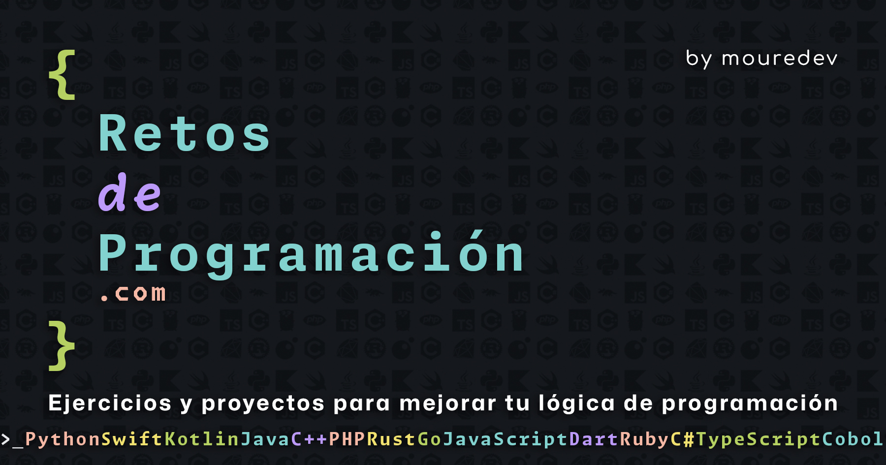

# Retos de Programación Web

## Proyecto web "Retos de Programación"

> Ejercicios, retos y aplicaciones para mejorar tu lógica de programación con cualquier lenguaje. Gratis, a tu ritmo y en comunidad.

### Visita [https://retosdeprogramacion.com](https://retosdeprogramacion.com)

## Proyecto, configuración y despliegue
    
> Tienes toda la información sobre cómo desarrollar, ejecutar y desplegar el proyecto en este otro [sitio web](https://github.com/mouredev/adeviento-web) que he creado usando las mismas tecnologías.

## Recursos utilizados

Inspirado en el grandísimo diseño del sitio web de la fuente [Monaspace](https://monaspace.githubnext.com/) creada por GitHub.

* Lenguaje: [Python](https://www.python.org/)
* Framework: [Reflex](https://reflex.dev/)
* Fuentes: [Monaspace](https://github.com/githubnext/monaspace) y [Mona Sans](https://github.com/github/mona-sans)
* Hosting: [Vercel](https://vercel.com/)

## Aprende a desarrollar una web como esta

Curso gratis para aprender desarrollo frontend Web con Python puro desde cero con Reflex. Las tecnologías usadas para desarrollar el proyecto de los "Retos de Programación". También tengo un curso de Python desde cero para principiantes.

##  Hola, mi nombre es Brais Moure.
### Freelance full-stack iOS & Android engineer

Soy ingeniero de software desde 2010. Desde 2018 combino mi trabajo desarrollando Apps con la creación de contenido formativo sobre programación y tecnología en diferentes redes sociales como **[@mouredev](https://moure.dev)**.

### En mi perfil de GitHub tienes más información

